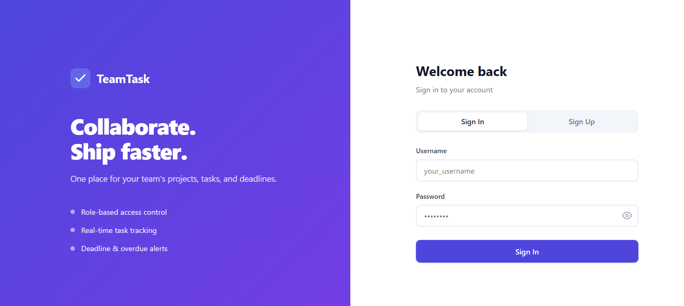
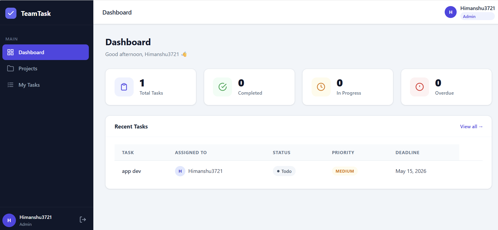
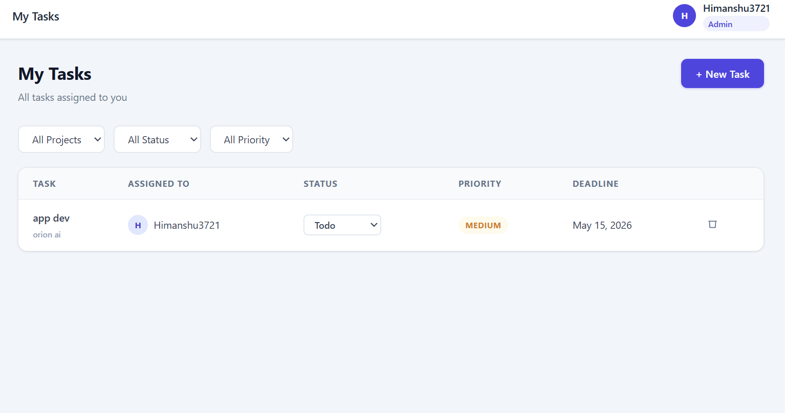

# Team Task Manager

🔗 **Live Demo:** https://ethara-task-manager-production-1bfc.up.railway.app/

A full-stack task management system built with Flask REST APIs, featuring role-based access control, project collaboration, and real-time task tracking. Deployed on Railway.

---

## Features

* User Authentication (JWT-based login/signup)
* Role-Based Access (Admin / Member)
* Project creation & team management
* Task assignment & status tracking
* Dashboard with task overview & overdue alerts

---

## Tech Stack

* **Backend:** Flask (REST API)
* **Frontend:** HTML, CSS, JavaScript
* **Database:** PostgreSQL (Production), SQLite (Local)
* **Auth:** JWT

---

## Project Structure

```
ETHARA/
├── backend/              # Flask API
│   ├── app/              # Models, routes, utils
│   ├── instance/         # Local DB
│   ├── config.py
│   └── run.py
├── frontend/             # UI
│   ├── index.html
│   ├── dashboard.html
│   ├── css/
│   └── js/
├── wsgi.py               # Production entry point
├── Procfile              # Railway config
├── runtime.txt
└── requirements.txt
```

---

## Why this project?

This project demonstrates backend API design, authentication, database integration, and deployment skills required for real-world applications.

---

## Run Locally

```
cd backend
pip install -r requirements.txt
python run.py
```

---

## Deployment

Deployed on Railway using Gunicorn and PostgreSQL.

---

## Demo Usage

* Register a new account
* Create a project
* Add and assign tasks
* Track progress via dashboard

## Screenshots

### Login Page


### Dashboard


### Task Management
